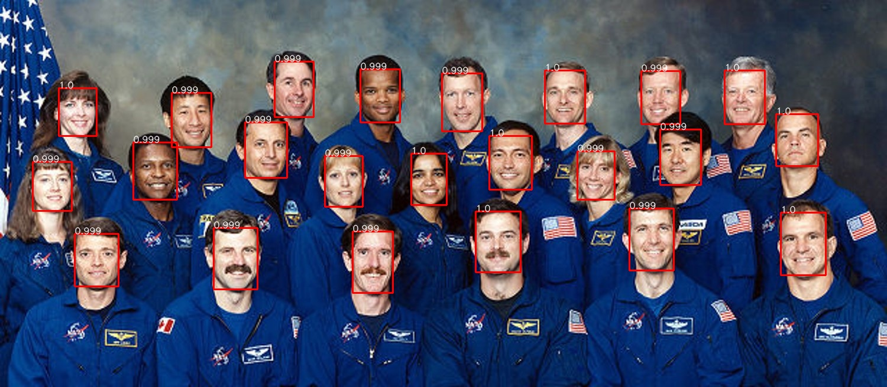

# Face recognition homework

## Download model
https://github.com/boiler-lab/face_detect_homework/raw/master/model.pt
## Install dependent package
```shell
pip install -r requirements.txt
# or pip3 install -r requirements.txt
```
## Run code
```shell
usage: detect.py [-h] [--model_path MODEL_PATH] [--input INPUT]
                 [--output OUTPUT]

Face detection

optional arguments:
  -h, --help            show this help message and exit
  --model_path MODEL_PATH
                        pretraining parameter path
  --input INPUT         input image path
  --output OUTPUT       output detected image save path
```
## Result

---
